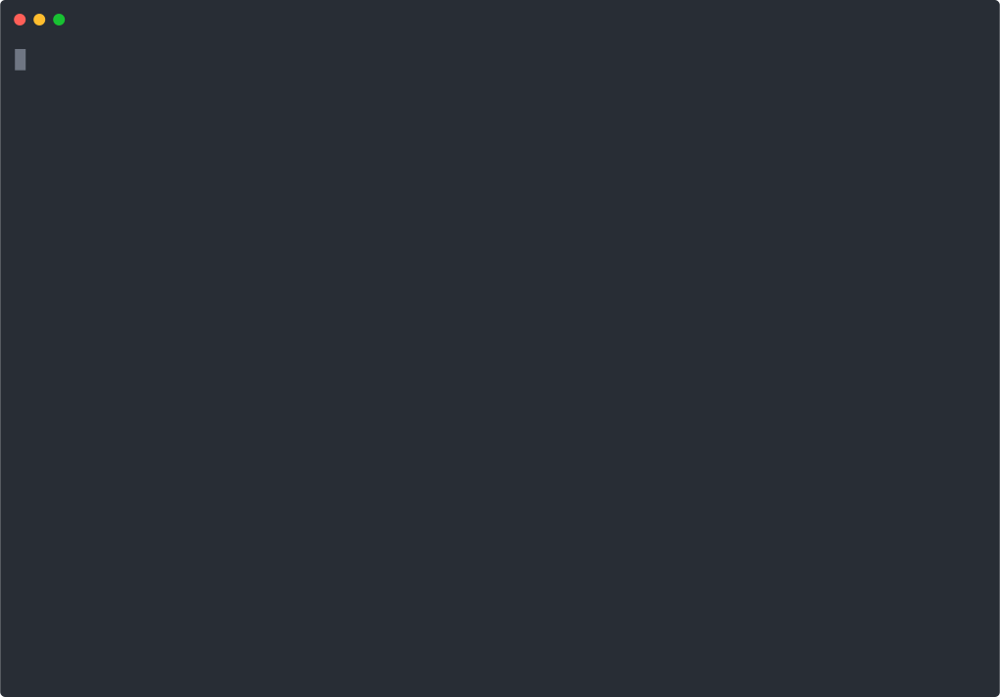
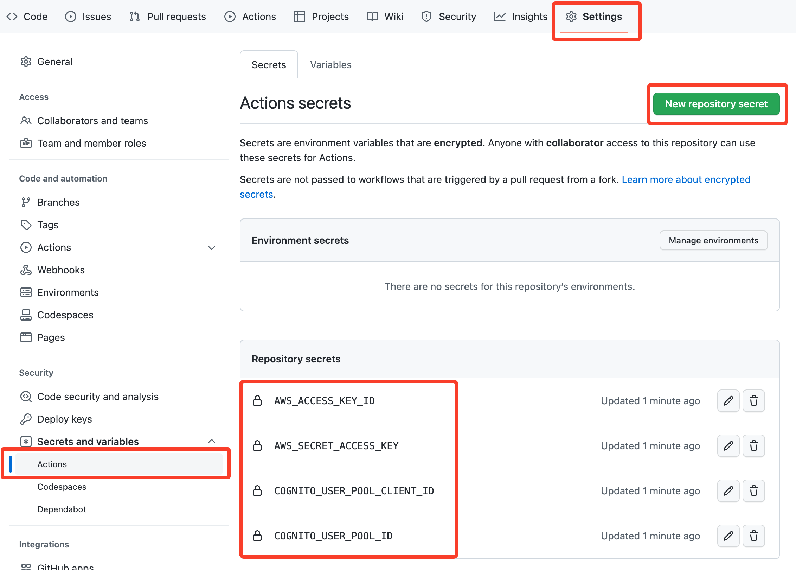
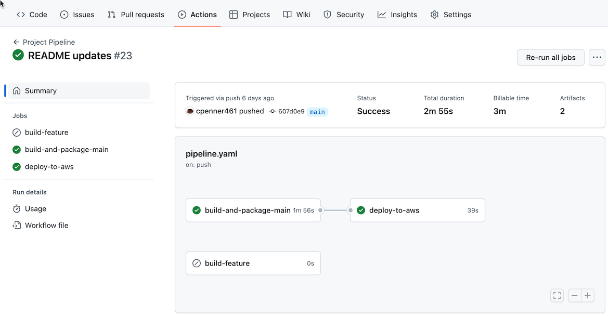

# Unit 5 Project Setup

This document outlines the different steps you'll need to follow in order to set things up for local development and remote deployment to AWS. It's a long document and looks like a lot, but there are really just a few things that we need to do:

- [AWS Profile Configuration](#aws-profile-configuration): a new AWS profile
- [Development/Deployment Scenarios](#developmentdeployment-scenarios): how we'll deploy our code manually, and (even better) how we'll have GitHub do it automatically for us

## AWS Profile Configuration

We have a new profile that we'll be using for this project. You'll share a new team profile with your team to deploy your code to AWS. You'll also continue to use the same individual profile you've been using for all of your local development.

To add the new profile run the command `aws configure sso` and provide the following inputs as prompted:

- SSO session name: `midstone`
- SSO start URL: `https://nss-se.awsapps.com/start/`
- SSO Region: `us-east-2`
- SSO registration scopes: _accept the default_ (press Enter)
- Choose your team account when prompted to choose an account.
- CLI default client Region: press Enter to accept the default of `us-east-2`. _If the default is missing or different, enter `us-east-2`._
- CLI default output format: `json`
- CLI profile name: `midstone`

After doing this, you'll be able to run the command `nss_aws_login midstone` whenever you need to run things in your team account, and `nss_aws_login individual` whenever you need to run things in your individual account. The [Deployment Scenarios](#developmentdeployment-scenarios) section will explain this in more detail.

## Development/Deployment Scenarios

We'll do most of our development locally with `sam` like we've been doing so far. Requests that access and/or manipulate data in DynamoDB will continue to reach out to the DynamoDB tables in AWS. There are 3 different scenarios that you will use. You should work through each Scenario in the order listed your first time through to configure all the necessary parts.

### Prerequisites

We need to install something called NodeJS before we can run some of the commands below (the `npm` ones).

- On Windows / WSL:
```shell
curl -fsSL https://deb.nodesource.com/setup_18.x | sudo -E bash - &&\
sudo apt-get install -y nodejs
```
- On macOS:
```shell
brew install node@18
brew link --overwrite node@18
```

After installing this you should be able to run `node --version` and see a version number like `v18.17.1`. If it doesn't work at all or it doesn't start with `v18` please create a support request as described in Canvas.

### Scenario 1: Local Backend, Local Frontend

In this scenario you will run both the backend and frontend locally on your laptop. You should use your **individual** AWS account in this scenario so that all data in DDB is yours and yours alone. Even though we'll be running the backend locally, we need some DynamoDB tables created in AWS so the setup for this involves some remote AWS configuration.

1. Run the Lambda service (aka the backend):
   - Build the Java code: `sam build`
   - Choose a Cognito Domain name matching the pattern `project-{NAME OF PROJECT}-{FULL NAME}`. E.g. `project-star-gazer-john-doe`. You'll use this in the next several commands.
      > **NOTE** If the Cognito domain name contains anything other than lowercase letters, numbers, and hyphens, then the domain name isn't accepted. You can't use a hyphen for the first or last character. The maximum length of the whole domain name, including the dots, is 63 characters.
   - Create an S3 bucket: `aws s3 mb s3://nss-s3-c##-u5-project-YOUR.NAME` (Replace `c##` with your cohort number, e.g. `c01` for Cohort 1, and replace `YOUR.NAME` with your first and last name.)
      > **NOTES:** 
      > - S3 bucket names must be lower case.  
      > - You only need to do this once.
   - Deploy the SAM template: 
     ```
     sam deploy --s3-bucket __BUCKET_FROM_ABOVE__ \ 
     --parameter-overrides S3Bucket=__BUCKET_FROM_ABOVE__ \ 
     CognitoDomain=__COGNITO_DOMAIN_FROM_ABOVE__ \
     FrontendDeployment=local
     ```

      > **NOTE:** _Yes you have to provide the same S3 bucket name twice._

     **Take note of the "Outputs" produced by the deploy command. You will be using these soon.**

   - Create some sample data: `aws dynamodb batch-write-item --request-items file://data/data.json`
      > **TIP:** You only need to do this once.
      >
      > _The sample data provided here is specific to the Music Playlist Service, you will either delete or replace this when you start your own project, but it's quite useful for now when you're trying to get everything working._
   - Run the local API: `sam local start-api --warm-containers LAZY`

2. Configure the frontend application (in a new terminal window or tab):
   - CD into the web directory: `cd web`
   - Copy the `sample.env.local` file to `.env.local`: `cp sample.env.local .env.local`
   - Open the `.env.local` file in IntelliJ or Visual Studio Code and update the value for these environment variables using the data from the "Outputs" of the `sam deploy` in the previous section.
      - `COGNITO_DOMAIN`
      - `COGNITO_USER_POOL_ID`
      - `COGNITO_USER_POOL_CLIENT_ID`

      > **NOTE:** The other environment variables should already have the correct value to run everything locally.

3. Run a local web server (aka the frontend):
   - Make sure you are in the `web` directory.
   - Install dependencies: `npm install`
       > **TIP:** You only need to do this once - _unless_ you add/change Javascript dependencies.
   - Run the local server: `npm run run-local`

After doing all of this, you will have a server running on port `8000` - you can access it by going to [http://localhost:8000](http://localhost:8000) in your browser. Create a playlist, add some songs to it (see [data.json](./data/data.json) for sample ASIN and track numbers you can use). If this is the first time you've tried to log into the application since deploying it, you'll need to create a Cognito user using the "Sign up" link after clicking the "Login" button.

To stop either the local backend (the `sam local...` command) or local frontend (the `npm run...`) command, simply press `Ctrl-C` in the terminal where the process is running.

> **TIP:** The `COGNITO_*` variables above are examples of [environment variables](https://en.wikipedia.org/wiki/Environment_variable) that the frontend configuration is looking for in order to connect to the [Amazon Cognito](https://docs.aws.amazon.com/cognito/latest/developerguide/what-is-amazon-cognito.html) service.

### Scenario 2: Remote Backend, Local Frontend

In this scenario you will deploy the backend to AWS and run the frontend locally on your laptop. You should use your **individual** AWS account in this scenario so that all data in DDB is yours and yours alone.

1. Choose a Cognito Domain name matching the pattern `project-{NAME OF PROJECT}-{FULL NAME}`. E.g. `project-star-gazer-john-doe`. If you've already deployed Scenario 1, you can/should use the same Cognito Domain as that. You'll use this in the next several commands.
   > **NOTE** If the Cognito domain name contains anything other than lowercase letters, numbers, and hyphens, then the domain name isn't accepted. You can't use a hyphen for the first or last character. The maximum length of the whole domain name, including the dots, is 63 characters.

2. Deploy the Lambda service (aka the backend):
   - Build the Java code: `sam build`
   - Deploy it: 
   ```
   sam deploy --s3-bucket __BUCKET_FROM_ABOVE__ \
   --parameter-overrides S3Bucket=__BUCKET_FROM_ABOVE__ \
   CognitoDomain=__COGNITO_DOMAIN_FROM_ABOVE__ \
   FrontendDeployment=local
   ```

     **Take note of the "Outputs" produced by the deploy command. You will be using these soon.**
3. Configure the frontend application:
   - CD into the web directory: `cd web`
   - Copy the `sample.env.remote` file to `.env.remote`: `cp sample.env.remote .env.remote`
   - Open the `.env.remote` file in IntelliJ or Visual Studio Code and update the value for these environment variables using the data from the "Ouptuts" of the `sam deploy` in the previous section.
      - `API_BASE_URL`
      - `COGNITO_DOMAIN`
      - `COGNITO_USER_POOL_ID`
      - `COGNITO_USER_POOL_CLIENT_ID`

4. Run a local web server (aka the frontend):
   - CD into the web directory: `cd web`
   - `npm run run-remote`

After doing all of this, you will have a server running on port `8000` - you can access it by going to [http://localhost:8000](http://localhost:8000) in your browser. The difference from Scenario 1 is that now the Lambda functions are running in AWS. If you open the developer tools in your browser you will see some of the requests being made to a URL like `https://GATEWAY_RESOURCE_ID.execute-api.us-east-2.amazonaws.com/Prod`. Once you have made several requests this should be noticeably faster than running the code locally on your laptop.

### Scenario 3: Remote Backend, Remote Frontend - Continuous Delivery

In this scenario all the code will be deployed to AWS using a [GitHub Action](https://docs.github.com/en/actions). This approach mimics a real world [_continuous delivery pipeline_](https://www.atlassian.com/continuous-delivery/principles/pipeline). A new version of the application will be deployed whenever a pull request is merged into the `main` branch. **This is the approach you will use for the Unit 5 Midstone Project for deploying both the backend and frontend code to AWS.**

You should use your **midstone**/group AWS account in this scenario so that all data and code is shared by your team.

**NOTE: Walk through these steps with your group.** The configuration steps only need to be done by **one person** on the team, and then your GitHub repo and AWS group account will be configured for the rest of the team.

#### One Time Configuration

Before this scenario will work, you need to perform a few steps:

> _Friendly reminder to make sure you're logged in with your **midstone** AWS account for this scenario!_

1. Create a team S3 bucket: `aws s3 mb s3://nss-s3-c##-u5-project-YOUR.TEAM.NAME` (Replace `c##` with your cohort number, e.g. `c01` for Cohort 1, and replace `YOUR.TEAM.NAME` with your team's name.)

    > **NOTE:** S3 bucket names must be lower case.

2. Choose a team Cognito Domain name matching the pattern `project-{NAME OF PROJECT}-{TEAM NAME}`  E.g. `project-star-gazer-team-awesome`
   > **NOTE** If the Cognito domain name contains anything other than lowercase letters, numbers, and hyphens, then the domain name isn't accepted. You can't use a hyphen for the first or last character. The maximum length of the whole domain name, including the dots, is 63 characters.

3. Deploy the Lambda service (aka the backend). _NOTE that the primary purpose of deploying this now (with your group AWS account) is to create several of the resources that we need to plug into the GitHub Actions configuration. This is the only time that you'll deploy manually to your AWS account._:
    - Build the Java code: `sam build`
    - Deploy it: 
     ```
      sam deploy --s3-bucket __BUCKET_FROM_ABOVE__ \
      --parameter-overrides S3Bucket=__BUCKET_FROM_ABOVE__ \
      CognitoDomain=__TEAM_COGNITO_DOMAIN_FROM_ABOVE__
     ```

      **Take note of the "Outputs" produced by the deploy command. You will be using these soon.**

4. Run `sam pipeline bootstrap`: This will create some AWS resources necessary to deploy your code. Use the following answers to the questions asked:
   - Stage definition: `ServiceStage`
   - Account details: Select your midstone profile (e.g. `midstone`)
   - Region: `us-east-2` _(this should be the default)_
   - User permissions provider: IAM _(this should be the default)_
   - "Enter the __ ARN ... or we will create one for you": _you'll see a series of these questions, leave all of them blank_
   - "Does your application contain any IMAGE type Lambda functions?": `N` _(this should be the default)_
   - Confirm the summary (press Enter)
   - Enter `y` to proceed with creation
   - **When you see the `Pipeline IAM user credential` output, save the values shown for `AWS_ACCESS_KEY_ID` and `AWS_SECRET_ACCESS_KEY`.** You will not be shown these again, but will need to use them in the next step.

   <details>
      <summary><b>Click to see a screen recording of this step...</b></summary>
      
      <em>Figure 1: Screen recording of `sam pipeline bootstrap`. Several values have been replaced with fake or obfuscated values. Your list of AWS accounts may be different than what's shown here.</em>
   </details>

5. Go to the "Settings" page of your teams GitHub repository and click on "Secrets and variables", then "Actions". Click the "New repository secret" button, and set the Name to `AWS_ACCESS_KEY_ID`, and the Secret to the value shown in the prior step, and then click the "Add secret" button. Repeat this for `AWS_SECRET_ACCESS_KEY`, `COGNITO_USER_POOL_ID` and `COGNITO_USER_POOL_CLIENT_ID` (the COGNITO values are output from the `sam deploy` command you ran just above).

    When you have completed this you should see each of them listed in the "Repository secrets" section of this page. NOTE that you will only see the name of the secret, and not the secret itself. This is expected. 

    > **NOTES:** 
    > * Remember to use the `COGNITO_USER_POOL_ID` and `COGNITO_USER_POOL_CLIENT_ID` from the deploy you made with the group account (Step 2 of Scenario 3) 
    > * You will also see some "Organization secrets" listed at the bottom of the page like `GH_PACKAGE_REG_READ_PASS` and `GH_PACKAGE_REG_READ_USER` - you do not need to do anything with these.

   <details>
      <summary><b>Click to see a screenshot of this step...</b></summary>
      
      <em>Figure 2: GitHub repository secrets configuration.</em>
   </details>

6. Run `sam pipeline init`: This will create the workflow file needed to enable GitHub Actions to build and deploy your code. Use the following answers to the questions asked (otherwise accept the default):
   - Pipeline template: "2 - Custom Pipeline Template Location"
   - Template Git location: `git@github.com:NSS-Software-Engineering/u5-pipeline-template.git`
      > **NOTE:** You can see this repo [here](https://github.com/NSS-Software-Engineering/u5-pipeline-template) if you are interested.
   - _Several prompts will be given where you can just accept the default by pressing enter._
   - Stage configuration name: "1" (ServiceStage - you created that earlier).
   - "What is the sam application stack name": provide a descriptive name with no spaces in it; when starting with the example code you might want to use something like `music-playlist-service`, but when you start building your own service you should rename this to something that makes more sense.
   - "What is the API Gateway URL": API_BASE_URL from `sam deploy` outputs
   - "What is the Teams Cognito Domain": __TEAM_COGNITO_DOMAIN_FROM_ABOVE__ (don't include ".auth.us-east-2.amazoncognito.com")
   - "What is the CloudFront Redirect Sign In URL": COGNITO_REDIRECT_SIGNIN from `sam deploy` outputs
   - "What is the CloudFront Redirect Sign Out URL": COGNITO_REDIRECT_SIGNOUT from `sam deploy` outputs
   - After answering the questions this will create a file `.github/workflows/pipeline.yaml`. If you are rerunning this at a later time, it will ask you if you want to overwrite it, which you will probably want to at that point. And of course you've committed it previously, so it's ok if you overwrite it ... right?!

   <details>
      <summary><b>Click to see a screen recording of this step...</b></summary>
      
      <em>Figure 3: Screen recording of `sam pipeline init`. Several values have been replaced with fake or obfuscated values and/or might be different than what you see.</em>
   </details>

7. Create a branch named like `feature/github-pipeline`, commit the pipeline file from the prior step, and push the changes. You should see a build start in the Actions tab of the repository. 

8. Open a PR from that branch back to main. When the build succeeds, you can merge the PR.

    The act of merging the PR should trigger a deploy to AWS. Check the Actions tab to watch the progress.

9. After the deploy is complete, create some sample data: `aws dynamodb batch-write-item --request-items file://data/data.json`

   > **TIP:** You only need to do this once. You did this earlier in the _individual_ AWS account, but if you want to use the app in the _group_ account you need to load the data again here.

_Whew_ that was a lot of configuring. If you've run into issues with any of this please please create a support request as described in Canvas.

If everything all worked, take a minute and pat yourself and your teammates on the back. At this point you might be wondering "where in the cloud is my website that's now being deployed??". Good question. You can find the answer by running the command `aws cloudfront list-distributions` and looking for a key named `DomainName` (or logging into the AWS Web Management Console and loading the CloudFront console). That should have a value like `ALPHANUMERIC.cloudfront.net`, you can open that in your browser. If everything has been configured correctly you can open the browser dev tools and see your web app making requests to a URL like `https://GATEWAY_RESOURCE_ID.execute-api.us-east-2.amazonaws.com/Prod/`.

> **TIP:** The CloudFront domain should also have been output at the end of the `sam deploy` command that you ran for this scenario.

#### Development Process Overview

Once you (or someone on your team) have performed all the configuration steps outlined above, things should be much simpler. All the AWS and GitHub configuration shouldn't require (too many) changes from this point, so you can focus on developing your software. You'll follow a process like the following:

1. Create a branch named `feature/NAME-OF-FEATURE` and commit your changes to that branch.
   - As you push changes to this branch, the `build-feature` job in the GitHub Actions will build the code.
1. When the work is done open a PR back to `main`.
   - The PR will "see" the corresponding build for the `build-feature` job. This build must pass before you can merge the PR.
1. When the PR is merged, a new build will trigger, which will include the `build-and-package-main` and `deploy-to-aws` jobs. When this job completes your latest code will be deployed.

> **NOTE:** You should also do all of your development on a branch like `feature/NAME-OF-FEATURE` for Scenarios 1 and 2.

<details>
   <summary><b>Click to see a screenshot of this step...</b></summary>
   
   <em>Figure 4. GitHub Action workflow showing the `build-and-package-main` and `deploy-to-aws` jobs running after a PR merge.</em>
</details>

## Development Notes

- We noted this above, but wanted to emphasize it again. **You should do all of your development on branches named like `feature/NAME-OF-FEATURE` regardless of what type scenario you are using to deploy/test the software.** Even if you are developing/testing locally, you will end up wanting to deploy it to AWS and the GitHub Actions will only execute on branches that start with `feature`.
- When running the backend code locally, if you make changes to your Java code you'll need to rerun `sam build` to "deploy" those changes to the local Docker containers. Depending on your computer, you might be able to run `sam build` in a different terminal tab while the local API is running, however it's also possible that this won't work and you'll need to stop the local API, rerun `sam build`, and then rerun `sam local start-api`.
- The way we launch the local API should look familiar to what we've done previously. However, we've added an important argument here: `--warm-containers LAZY`. When you are interacting with your service from a web application you want it to respond as quickly as possible. By adding this argument we tell SAM to keep the Docker containers "warm", that is - don't terminate them after each request. The argument `LAZY` tells it to wait for a request to come in before launching the Docker container. The first time you use each endpoint in the service it will take a few seconds to launch and respond. Successive times that you use the endpoint will be much faster. If you don't include this argument each request will take longer than you want it to.
- If you make changes to the frontend code (e.g. Javascript/HTML/CSS code) you do not need to restart the `npm` server - it will automatically detect them. If you change anything in the _configuration_ of the frontend code (e.g. `webpack.config.js` or `package.json`) you will need to stop/restart it.
