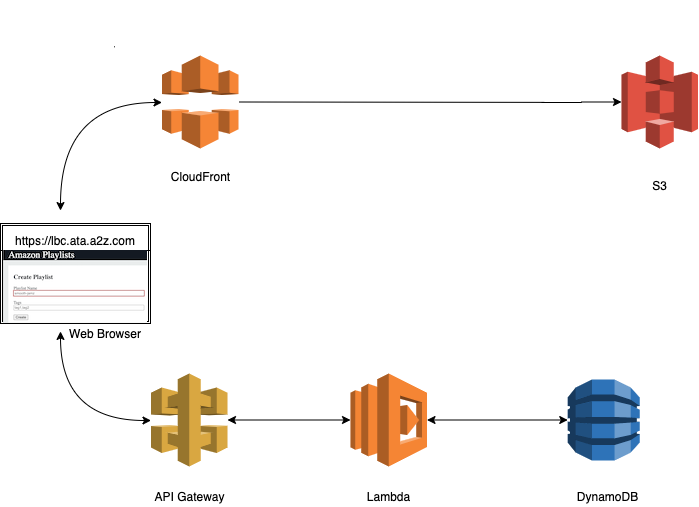
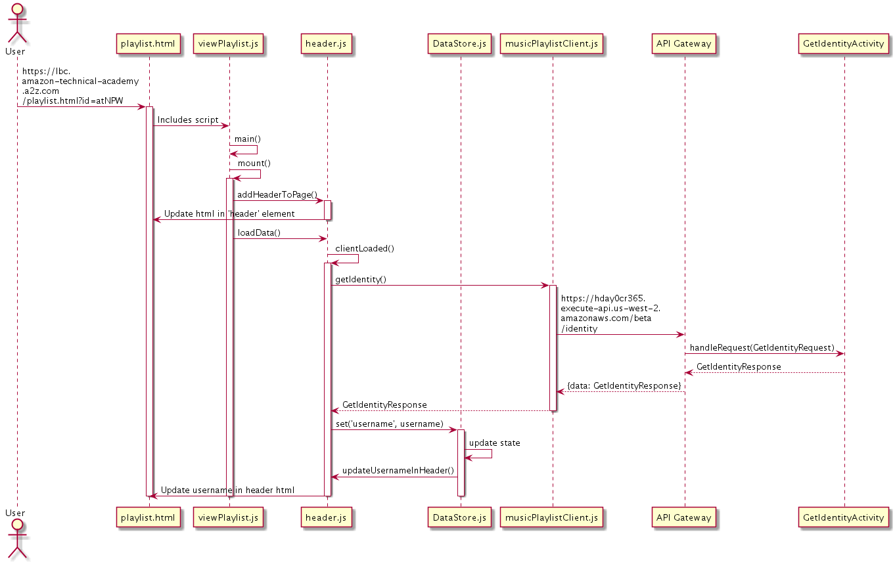

# Unit 5 Project Intro

Welcome to the Unit 5 Project. This project is a starting point that you'll be making extensive changes to as you design and build your own application. The code provided here is a starting point meant to remind you of patterns that we've been using, as well as show you a few new patterns that you might find useful. This document has 2 main sections:

- Deliverables
- Infrastructure

> **NOTE:** There's a lot to this project, so we've split out the more tactical "how to" guidance into a [separate README](./README-SETUP.md) that you'll want to review and follow the included instructions for after you read through this one.

## Deliverables

These are the required deliverables/reviews that you and your team will need to create during the project. _The status of each of these will be tracked in the GitHub project that your team is using._

### Team Deliverables

* **Design Document: Problem Statement** Your team’s technical design specification. Complete [this template](resources/design-document.md). This should explain the product you'll be creating and what problem it solves.
* **Design Document: Peer Team Review** Another team will review your technical design to help improve it. Each team will review at least one other teams design.
* **Design Document: Instructor Review** One of the instructors will review your technical design after you've create it and reviewed it with another team.
* **Team Charter:** Statements of how your team will work to ensure constructive collaboration, fairness, that everyone is learning and contributing. Complete [this template](resources/team-charter.md).
* **Working Product:** Your project, as a working website deployed to AWS.
* **Team Reflection:** A final retrospective with a few questions to answer as a team to reflect on what you have accomplished and learned throughout the project. Complete [this template](resources/team-reflection.md).

### Individual Deliverables

* **Accomplishment Tracking:** You'll be keeping a log of your individual accomplishments and lessons learned throughout this project week-by-week. Keeping a high level record of your accomplishments throughout your career is useful for your career growth and promotion. Use [this template](resources/individual-accomplishments-template.md) as a starting point, but you can keep this log in whatever tool/location you'd like.

## Technical Learning Objectives

This project is very open-ended and you/your team will be doing a lot of creative thinking to decide what you want to build. That said, there are several technical learning objectives that each team must meet. You should review the [Technical Learning Objectives](./resources/technical-objectives.md) as you familiarize yourself with the project. As part of the team reflection/retrospective you'll fill out this document with your team to document how you met the different objectives.

## Project Starter Infrastructure

Your team has been provided with a website, hosted by [CloudFront](https://aws.amazon.com/cloudfront/), that talks to an Amazon API Gateway endpoint. (A web front-end is likely new for several of you, as your unit projects so far have been all service development.) The Amazon API Gateway connects to a Lambda service, which stores its data in DynamoDB, an architecture that we’ve used several times on unit projects so far. The starter code provided contains a website that uses the playlist service you created in Unit 3. Below, Image 1 describes the architecture of the starter project.

*Image 1: Architecture diagram for the starter project*

### Introduction to the Starter Code

Unlike our unit projects in the past, this project will have two code bases.

[One code base](./MusicPlaylistServiceLambda) will be for your Lambda service code, similar to what we’ve seen previously. This will contain code that designs and runs your service APIs, as well as packages to interact with and test your service.

The [second code base](./web) will contain code for your website:

* HTML: The content of your web pages
* CSS: The styling and formatting of your web pages
* JavaScript: The code that runs when a user interacts with the web pages, some of which triggers the browser to send requests to the service

Often times these are separated into different repositories, but for simplicity’s sake we've kept them in the same repository for this project.

Delve into the website code with a comprehensive breakdown by referring to the [website blueprint](./web/docs/blueprint.md). This document provides a detailed exploration of the project's structure, architecture, and key components, helping you better understand the codebase and its organization.

_Both of these should be considered starting points/example code. You will end up removing/replacing all of it as you build your own project._

### User Authentication With Cognito

We're using [AWS Cognito](https://aws.amazon.com/cognito/) to manage our user authentication. You won't have to do a lot with it, but you should know it's there. As you move through the different [setup](README-SETUP.md) steps you'll choose a name for your "Cognito Domain" based on your project, and the SAM/CloudFormation template should handle the rest.

The first time that you login to your application (or if you ever have to delete and redeploy the whole CloudFormation stack) you'll need to click the "Sign up" link in the login prompt. It's likely that you'll end up needing to create multiple test users along the way, we recommend using a [plus alias](https://gmail.googleblog.com/2008/03/2-hidden-ways-to-get-more-from-your.html). If your email address is `myname@example.com` you can create a Cognito account using the email `myname+test1@example.com`, and then later create another account using the email `myname+test2@example.com`.

### Deploying

We'll be using GitHub Actions to deploy the code to AWS. One of the first tasks that you'll do as a team is to configure the repository for this. Once that's completed your code should build and deploy as described in the [next README](./README-SETUP.md).

### AWS Resources

Each team has one AWS account they will share to deploy their website and service. This is where all of your changes will be merged together and visible. Your team's account will be named something like `SE_Unit_5_Group_TEAMNAME` and will be available for you to configure like you've done in previous units.

### Your website!

To access your website, you'll need to build it first. The [next README](./README-SETUP.md) has instructions on the different ways we'll be doing this.

## How Your Website Works

Creating each page of your website requires a surprising amount of interactions between different JavaScript files and between our frontend and our backend. Our view playlist page makes 3 separate calls to our MusicPlaylistService.

Let’s look at one piece - adding the header to our page. This requires the full end to end flow of HTML to JS to backend service all the way back to updating our HTML.

*Image 2: The end to end flow of HTML to JS to the backend service, and the return to HTML*

Two important things to call out:

1. To call our backend we are always going through our `MusicPlaylistClient`.
2. The `DataStore` uses a different pattern than we’ve seen previously. It has two member variables - the state, which is a JavaScript object that should hold all of the data being used across a webpage, and a list of listeners. The listeners are methods in other objects. Anytime `set` or `setState` is called it loops through all of those methods and executes each one. So in each of those listeners the first thing we do is check to see if the data that they rely on is null. Then, if it’s not null, we update the html to reflect the new data. You can take a look at the `addPlaylistToPage()` method in `viewPlaylist.js` for an example of this.

> **TIP:** There's a lot to take in here. The [website blueprint](web/docs/blueprint.md) we linked to earlier is a good resource to refer back to as you work through everything here.

## Project Setup

This document has provided an overview of the project as a whole. For more specifics on how to configure the project and your GitHub repo/AWS account, continue by reading [README-SETUP.md](./README-SETUP.md).
