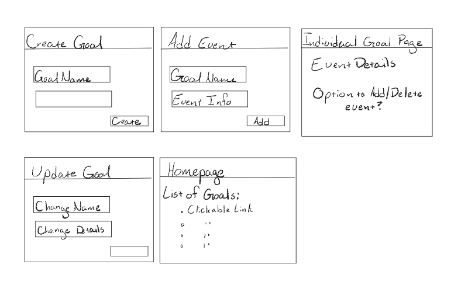

# Design Document

## Momentum Design

## 1. Problem Statement

When tracking goals, many people focus on the number of iterations they have achieved on a weekly basis by the calendar, and may deem themselves to have entered a failure state if they get out of sync with their initial plan.  If they instead focused on building habits measured on a rolling basis, the emphasis moves to what you could do today to move towards the goal rather than what you didn't do yesterday.

## 2. Top Questions to Resolve in Review

_List the most important questions you have about your design, or things that you are still debating internally that you might like help working through._

1. What information are we displaying to the user, what should be under the hood vs displayed to the user?
2. What is front end vs back end?
3. How do we track historical data for the habits?
4. Do we offer different tracking periodicities, and how do we display them side by side if so?
5. How are we calculating the ongoing habit status?

## 3. Use Cases

_This is where we work backwards from the customer and define what our customers would like to do (and why). You may also include use cases for yourselves (as developers), or for the organization providing the product to customers._

U1. As a Momentum user, I want to see my habit-forming momentum when I enter a new Action.

U2. As a Momentum user, I want to see my prioritized habits when I hit the landing page.

U3. As a Momentum user, I want to be able to enter a new habit with customizable periodicity and tracking metrics

U4. As a Momentum user, I want to be able to choose between a detailed view of my habit-forming and an overview summary.

## 4. Project Scope

### 4.1. In Scope

Create multiple habits and display momentum information within a rolling timeframe

The front end will have a detail page that will display in depth habit information, and main dashboard page showing a habit overview that links to the detail page.

The main dashboard page will have a button to create a new goal, this will lead to the create goal page.

New goals can be created from the main dashboard page.

The detail page will have place to enter or remove events

### 4.2. Out of Scope

Subcategories and super-categories

Overlaying different goals over historical data

Variable timeframes

Summary of all habits/life status

Choose the number of habits displayed in the detail page

# 5. Proposed Architecture Overview

The first iteration of the Momentum app will provide the minimum viable product including creating, retrieving, and updating habit goals, seeing your overall progress at a glance, and the ability to inspect each goal in detail.

We will use API Gateway and Lambda to create eight endpoints (`GetGoal`,
`CreateGoal`, `UpdateGoal`, `DeleteGoal`, `CreateEvent`, `DeleteEvent`)

We will store the goals and their associated entries in DynamoDB.   The main page will show an overview of your priority goals, as well as a search and selection mechanism that will allow you to go to the detail page of a particular goal.  The detail page will allow you to see in depth information about the goal and its associated events, and will allow you to add or remove new events as necessary.

# 6. API

## 6.1. Public Models

// GoalModel
String userId;
String goalName;
Integer timeFrame;
Double target;
Enum unit;
Boolean isFavorite;

// EventModel

String userId;
String eventId;
String goalName;
ZonedDateTime date;
Double measurement;

## 6.2. Get Goal Endpoint

* Accepts GET requests to /goals/:userID::goalName

* Accepts a goal name and returns the corresponding GoalModel
  * If the given goal is not found, it returns the GoalNotFoundException

## 6.3 Create Goal Endpoint

* Accepts POST requests to /goals/

* Accepts data to create a new goal with a provided goal name, momentum time frame, goal target, and measurement unit. Returns a new goal.
  * If the goal name contains any invalid characters, we will throw a InvalidAttributeException 

## 6.3 Update Goal Endpoint

* Accepts PUT requests to /goals/:userID::goalName

* Accepts data to update a goal including and updated goal name, momentum time frame, goal target, and measurement unit. Returns an updated goal.
    * If the given goal is not found, it returns the GoalNotFoundException
    * If the goal name contains any invalid characters, we will throw a InvalidAttributeException

## 6.4 Delete Goal Endpoint

* Accepts DELETE requests to /goals/:userID::goalName

* Accepts data to delete goal from goals table, returns success status
  * If the given goal is not found, it returns the GoalNotFoundException

## 6.5 Create Event Endpoint

* Accepts Post requests to /events/:userID::eventID

* Accepts data to create an event, including the date and the measurement. Returns the new event, including the unique eventID generated by the application and the goal name and user ID the event is associated with.

## 6.6 Delete Event Endpoint
* Accepts the DELETE requests to /events/:userID::eventID

# 7. Tables

// Goals

S userId - hashkey

S goalName - rangekey

N timeframe

N target

S unit

BOOL isFavorite

// Events

S userId - hashkey

S eventId - rangekey

S timestamp 

S goalName

N measurement

# 8. Pages

 